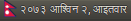

# nepali-calendar-indicator 
> Simple indicator applet to show Nepali date and calendar

Showing the calendar is not done yet. If anybody wants to contribute, you're welcome to do so :)

### Installation

The goal is to be able to do `pip install nepcal_applet` and have the applet running but there's little bit of work that needs to be done for that.

This requires python 3.x and python-gi. Make sure you have python-pip3 installed.

```shell
sudo apt install -y python3-pip
```

For time-being, the following works:

```shell
git clone https://github.com/techgaun/nepali-calendar-indicator.git
cd nepali-calendar-indicator
make install

# if you see permission errors (which should be due to system-wide pip)
sudo make install
nepcal_applet &
```

#### XFCE

This applet should work with Xfce DE once you enable Indicator plugin from `right-click panel > Panel > Panel preferences > Item > Add Item`.
If you don't see indicator plugin in the list of items to add, try installing `xfce4-indicator-plugin`.

```shell
sudo apt install -y xfce4-indicator-plugin
```

### Notes

- It currently uses local timezone. Some might prefer to use Nepal/Kathmandu timezone regardless of what timezone they are. Please make an issue if you think we should default to Nepal/Kathmandu.
- We have open [issues](https://github.com/techgaun/nepali-calendar-indicator/issues). If you want to contribute, you're more than welcome to grab those.
